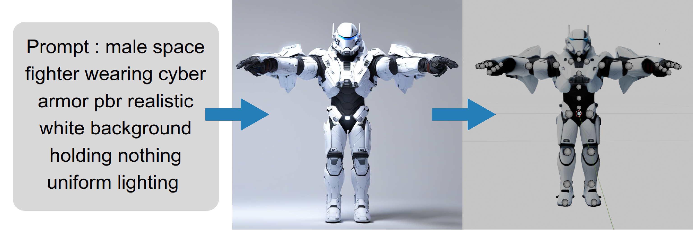

<h1>Prompt2Asset</h1>

<strong>Full pipeline to generate a fully functional asset from a single prompt</strong>

  

 

**Based on the following repositories :**

[Microsoft TRELLIS](https://github.com/microsoft/TRELLIS)  
[Dichotomous Image Segmentation (DIS)](https://github.com/xuebinqin/DIS)  
[UniRig](https://github.com/VAST-AI-Research/UniRig)

 

# Installation

To keep existing version:

pip install --no-deps --no-index --find-links=. --no-warn-script-location --no-cache-dir --ignore-installed -r requirements.txt

or

pip install -r requirements.txt

# Usage

For riggable character:

./generate_character.sh --prompt "prompt" --negative_prompt "negative prompt" --rig --use_pose --pose_image "character_pose.png"

For generic riggable object:

./generate_character.sh --prompt "prompt" --negative_prompt "negative prompt" --rig

For background asset:

./generate_character.sh "prompt"

# TODO
Use better 3d gen model like Hi3DGen or Hunyuan 3D 2.5

